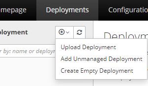
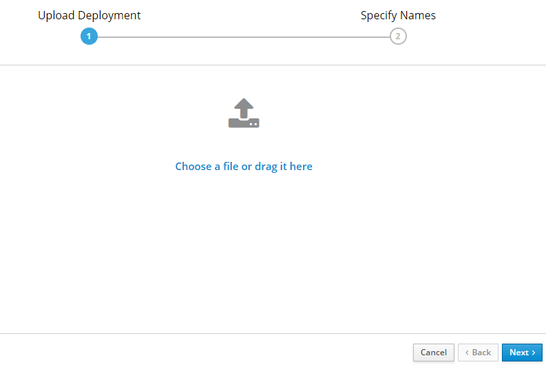
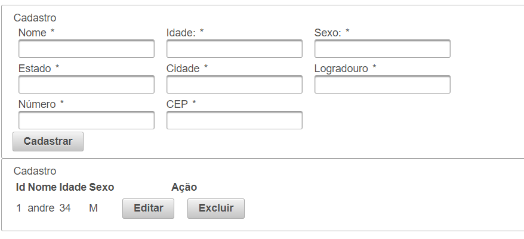
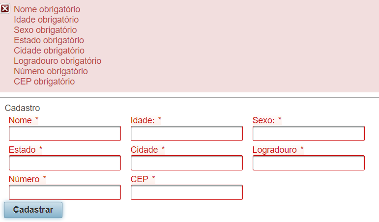
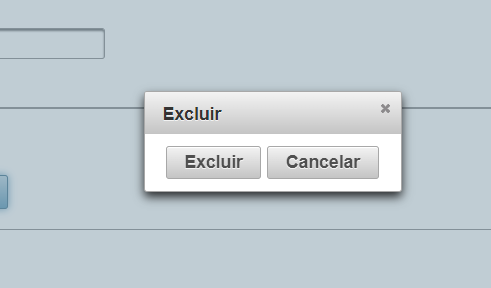
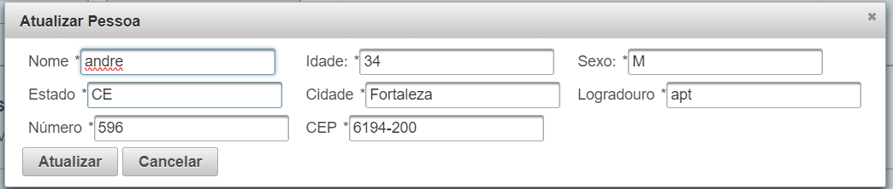

## Roda aplicação

- Entra na pasta do projeto e rodar o seguinte comando:
```
docker-compose up --build
```
- Nesse processo ele sobe o banco e já cria o banco cadpessoas

- Após rodar no docker

## Duas maneiras de rodar a aplicação

## Primeira forma
- Pegar o .war pronto e fazer o deploy manual no Wildfly 20
- Rodar o servidor Wildfly
- Acessa o console de administração: [Aqui](http://localhost:9990/console/index.html)

- Upload Deployment



- Next

 

- Finish
- Acesso a aplicação: [Aqui](http://localhost:8080/cadastro/index.xhtml)

## Segunda forma
- Adiciona a aplicação na sua IDE
- Da um `mvn clean install`
- Adiciona a aplicação no servidor wildfly
- Start na aplicação
- Acesso a aplicação: [Aqui](http://localhost:8080/cadastro/index.xhtml)

## Prints da aplicação

-  Tela



-  Validação dos campos



-  Excluir registro



-  Atualização do registro

